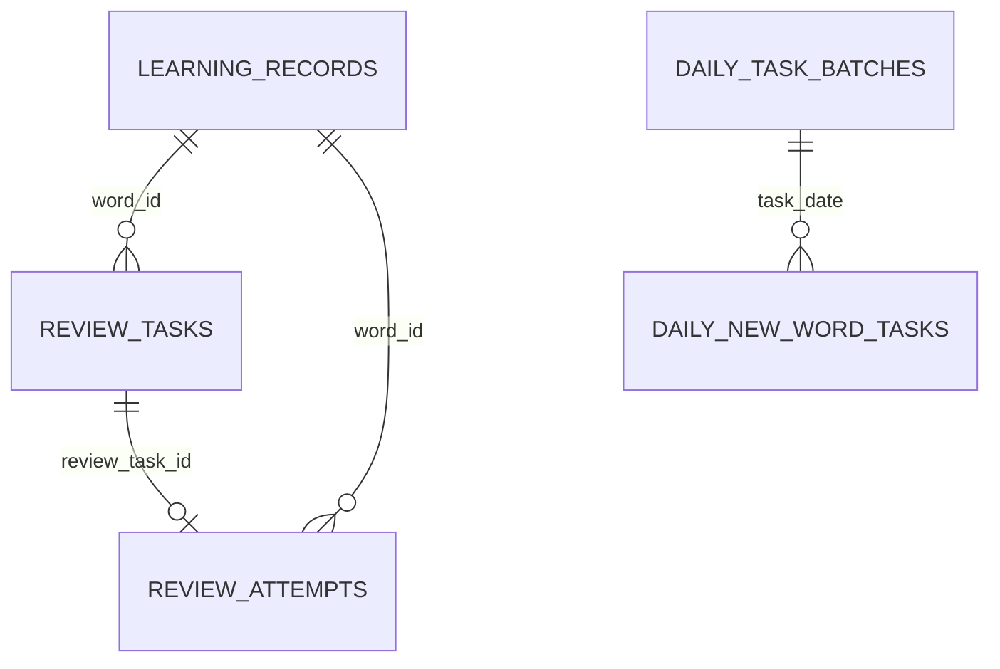

# 数据模型与 API

## 1. 正式词库

运行时文件为 `assets/vocabulary/kaoyan_clean.json`。根结构固定为：

```json
{
  "schemaVersion": 1,
  "book": {
    "id": "...",
    "name": "...",
    "version": 1,
    "description": "...",
    "expectedWordCount": 5847,
    "source": "...",
    "licenseNote": "..."
  },
  "words": [
    {
      "id": "radiate",
      "position": 1,
      "word": "radiate",
      "phonetic": "...",
      "meaning": "...",
      "example": "..."
    }
  ]
}
```

加载器执行严格校验：固定 SHA-256、精确字段集合、词数、连续 position、必填字符串、规范化 ID 和唯一性。当前固定哈希为 `d3a817ddb2d272a22ce51269096f65108b4e360ddeaec5352318dfff182646d1`。

正式学习 ID 为 `<vocabularyId>:<sourceId>`，当前示例是 `kaoyan_v1:radiate`。不要用数组位置作为持久化 ID，也不要把没有命名空间的历史 ID 静默映射到正式词库。

词库的生成与审校来源位于项目外层 `蒸馏/`，运行时 App 只读取最终 Asset。详细源文件格式见[正式词库文件格式说明](../../蒸馏/正式词库文件格式说明.md)。

## 2. SQLite V6

数据库文件名为 `recall_learning.db`，当前版本为 6，启用外键。日期字段以本地日期 `YYYY-MM-DD` 表示，时间点使用 ISO 8601 字符串。

| 表 | 用途 | 关键约束 |
| --- | --- | --- |
| `learning_records` | 每个词的聚合学习状态 | `word_id` 主键 |
| `review_tasks` | 已完成历史与当前待复习任务 | 每词最多一个未完成任务；按完成状态和日期索引 |
| `review_attempts` | 每次正式复习的不可变审计记录 | `review_task_id` 唯一；保存调度输入、输出和版本 |
| `vocabulary_settings` | 每日新词目标 | 单例 `id = 1`；目标范围 1～200 |
| `daily_task_batches` | 每日本地日期批次 | `task_date` 主键 |
| `daily_new_word_tasks` | 每日新词的分配与两阶段完成状态 | `word_id` 全局唯一；完整完成必须先完成第一层 |
| `context_articles` | 语境文章成功缓存及失败/跳过审计 | `context_session_id` 唯一；状态仅为 success/failed/skipped |

主要关系：



`context_articles` 通过稳定的 `context_session_id` 与一次目标词集合建立逻辑关联，不对每日任务设置外键，以便缓存和审计独立演进。

### 2.1 迁移原则

- 只在 `onUpgrade` 中追加或重建必要结构，不删除用户数据库。
- 增加字段后为历史行提供可解释的回填值；旧调度记录使用 `v0_record_only`。
- 新增唯一索引前必须先处理可能冲突的旧数据。
- Schema 变更必须同时更新内存仓库语义、SQLite 测试和本文件。

### 2.2 文章缓存语义

- `generateArticle` 先读取相同 `contextSessionId` 的 success 记录。
- success 记录是稳定缓存；普通失败或跳过不得覆盖已有 success。
- “重新生成”绕过读取缓存，成功后替换旧记录。
- failed 与 skipped 用于恢复和调试，不包含可展示正文。
- 导出数据不包含正文、请求 ID、后端 URL 或任何 Secret。

## 3. Worker HTTP API

根地址由部署环境决定。Flutter 自动在根地址后追加 `/v1/context-article`。

### 3.1 健康检查

```http
GET /health
```

无需认证，不调用 Provider：

```json
{ "ok": true, "service": "recall-ai", "version": "v1" }
```

### 3.2 生成语境文章

```http
POST /v1/context-article
Authorization: Bearer <RECALL_APP_TOKEN>
Content-Type: application/json
```

请求：

```json
{
  "requestId": "req-0123456789abcdef",
  "contextSessionId": "context-0123456789abcdef",
  "words": [
    {
      "wordId": "kaoyan_v1:derive",
      "word": "derive",
      "meaning": "v. 得到；推导出；源于",
      "priority": "unknown"
    }
  ]
}
```

约束：

- `requestId`、`contextSessionId`、`wordId` 使用 1～128 位安全标识符字符。
- `words` 为 1～15 个且 `wordId` 不重复。
- `word` 最长 100 字符，`meaning` 最长 500 字符，均不可为空。
- `priority` 只能是 `unknown`、`unsure`、`known`。

成功响应：

```json
{
  "requestId": "req-0123456789abcdef",
  "contextSessionId": "context-0123456789abcdef",
  "title": "A Deliberate Change",
  "article": "...",
  "usedWordIds": ["kaoyan_v1:derive"],
  "provider": "deepseek",
  "model": "deepseek-v4-flash",
  "promptVersion": "context_article_v1",
  "generatedAt": "2026-08-15T00:00:00.000Z"
}
```

Worker 与 Flutter 都会校验响应。`usedWordIds` 必须来自请求、不可重复，并且对应单词或 slash 分隔的合法表面形式必须按完整英文词边界出现在正文中。

### 3.3 错误响应

```json
{
  "error": {
    "code": "invalid_request",
    "message": "Invalid context article request"
  },
  "requestId": "req-0123456789abcdef"
}
```

稳定错误码包括：

| 类别 | 错误码 |
| --- | --- |
| 调用方 | `unauthorized`、`invalid_request` |
| 配置 | `provider_not_configured` |
| 上游 HTTP | `provider_auth_error`、`provider_invalid_request`、`provider_payment_required`、`provider_forbidden`、`provider_unavailable`、`provider_rate_limited`、`provider_http_<status>` |
| 执行与输出 | `provider_timeout`、`provider_error`、`invalid_model_output`、`server_error` |

错误响应不会包含堆栈、Token、API Key 或上游原始正文。客户端还会把本地超时、网络异常和无效响应归一为 `network_timeout`、`network_error`、`invalid_response` 等展示层错误。

## 4. Provider 扩展契约

新增 Provider 时：

1. 实现 `AiArticleProvider`，只接受统一的 `ContextArticleGenerationRequest`。
2. 在 `provider_factory.ts` 注册名称和所需环境变量。
3. 将厂商错误映射为稳定 `ServiceError`，不得透传密钥或原始敏感响应。
4. 复用统一 `ContextArticlePromptBuilder` 和 `ContextArticleValidator`。
5. 增加 Provider 合约、错误映射和路由测试。
6. 用环境变量切换 `AI_PROVIDER`、`AI_MODEL`；Flutter API 与 SQLite Schema 不应因厂商切换而变化。

## 5. 数据与隐私边界

请求只发送当前语境会话选出的词 ID、英文、正式中文释义和优先级。不发送全词库、复习历史、反应时间、遗忘次数、设备标识或用户身份。Worker 日志只应记录请求标识、会话标识、耗时、词数、Provider、模型、HTTP 状态和结果，不记录 Authorization、完整释义或文章正文。
