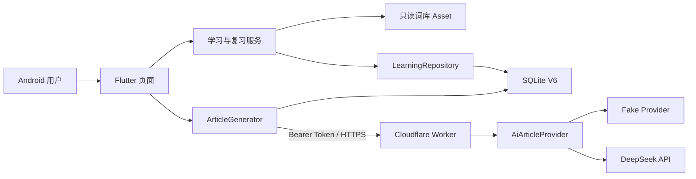
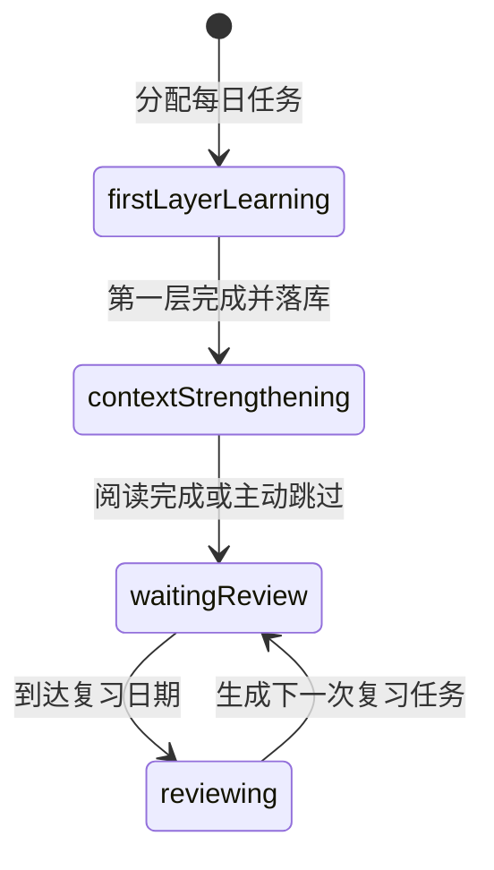

# 系统架构

## 1. 系统边界

Recall 采用“本地优先客户端 + 可选 AI 网关”的结构。词库与学习流程不依赖网络；网络仅用于生成语境文章。

安全边界：Flutter 只保存 Worker URL 和 Recall 访问令牌；`DEEPSEEK_API_KEY` 只存在于 Worker Secret 或本地未提交的 `.dev.vars`。

## 2. 客户端启动与依赖

`lib/main.dart` 是生产入口，启动顺序为：

1. 加载并校验 `assets/vocabulary/kaoyan_clean.json`。
2. 打开 `recall_learning.db`，自动执行 SQLite migration。
3. 创建 `SecureAiServiceSettings` 与 `RemoteArticleGenerator`。
4. 将词库、仓库和文章生成器注入 `RecallApp`。
5. 任一步骤失败时显示“Recall 启动失败”，不进入部分可用状态。

`RecallApp` 允许注入内存仓库、Fake 文章生成器和时间函数，因此业务与组件测试不依赖真机数据库或真实网络。

## 3. 模块职责

| 目录 | 职责 | 主要边界 |
| --- | --- | --- |
| `lib/pages` | 页面状态和导航 | 不承载调度算法或 SQL |
| `lib/learning` | 每日任务、第一层会话、语境会话、首次复习编排 | 依赖仓库接口和领域模型 |
| `lib/review` | 到期队列和正式复习间隔计算 | 纯规则，使用本地日历日 |
| `lib/context` | 重点词排序、远程请求、响应校验和缓存策略 | 只依赖统一 Worker 契约 |
| `lib/data` | 词库读取、仓库接口、SQLite/内存实现、导出 | 负责原子写入和持久化约束 |
| `lib/models` | 词条、学习记录、任务、文章等领域对象 | 不依赖 UI |
| `backend/recall_ai_worker/src` | 鉴权、输入校验、Prompt、Provider 调用、输出校验 | 不持有客户端学习历史 |

## 4. 核心流程

### 4.1 每日任务

`DailyTaskService.loadOrCreateToday()` 使用设备本地日期：

1. 读取每日目标和所有任务。
2. 统计今天以前仍未完成的历史任务。
3. 今日期望新分配数为 `max(0, 每日目标 - 历史待完成数)`。
4. 按正式词库顺序选择从未分配、也没有学习记录的词。
5. 在 SQLite 事务中创建或调整当天批次，并按“任务日期、任务 ID”返回待办。

现行调整规则：当天目标上调时补充尚未分配的词；目标下调时，从当天最后分配的任务开始移除尚未进入第一层的任务。已经进入第一层或已经完成的任务始终保留，因此保留数量可能高于新目标。数据库的 `word_id UNIQUE` 保证同一正式词不会跨日重复分配。

首页处理优先级为：到期正式复习 → 已完成第一层但未完成语境的任务 → 未完成第一层的任务 → 今日完成状态。

### 4.2 新词学习与语境强化

第一层根据 `known / unsure / unknown` 记录最多三次判断，并持久化完成结果。应用中断后，未完成词继续第一层，已完成第一层的词直接恢复语境环节。

`ContextWordSelector` 最多选择 15 个词，顺序为：困难词、首次 unknown、首次 unsure、首次 known；同优先级保持原顺序。`ContextSessionService` 用目标词 ID 列表的 SHA-256 构造稳定 `contextSessionId`。

文章流程先查本地成功缓存，再请求 Worker。失败不会自动无限重试；用户可重新生成或跳过。阅读完成和跳过都会沿用首次复习调度并结束每日任务。

### 4.3 首次复习

`FirstReviewScheduler` 按第一层结果计算首次正式复习日期：

| 第一层表现 | 首次间隔 |
| --- | ---: |
| 第三次仍为 unsure/unknown | 1 天 |
| 首次 unknown，最终 known | 1 天 |
| 首次 unsure，最终 known | 2 天 |
| 首次即 known | 3 天 |

所有“天”均为本地日历日，不按 24 小时滚动计算。

### 4.4 后续正式复习

当前调度器版本为 `v1_rule_5s_40pct`，基础间隔为 `1, 3, 7, 15, 30, 60, 120` 天：

- `unknown`：下一次 1 天。
- `unsure`：下一次 3 天。
- `known` 且反应时间不超过 5 秒：进入下一个基础间隔。
- `known` 但反应超过 5 秒：在当前间隔与下一个基础间隔之间前进 40%，至少增加 1 天。
- 最大间隔为 120 天；从实际复习日而非计划日计算下一日期。

一次复习的任务完成、attempt 写入、学习记录更新和下一任务创建由仓库原子完成。每个词最多存在一个未完成复习任务。

## 5. 版本化边界

| 项目 | 当前值 | 修改要求 |
| --- | --- | --- |
| 正式词 ID 命名空间 | `kaoyan_v1` | 换词库或 ID 规则时迁移旧记录 |
| SQLite Schema | `6` | 只追加 migration，不清空用户数据库 |
| Prompt | `context_article_v1` | 行为变化时升级并保留审计字段 |
| 复习调度器 | `v1_rule_5s_40pct` | 规则变化时升级，attempt 记录版本 |

## 6. 明确不在当前范围

当前没有登录、云同步、通知、FSRS、多词库、RAG 或客户端直连模型厂商。Cloudflare Worker 的正式部署和真实 Provider 可用性属于环境状态，不由客户端代码自动保证。
